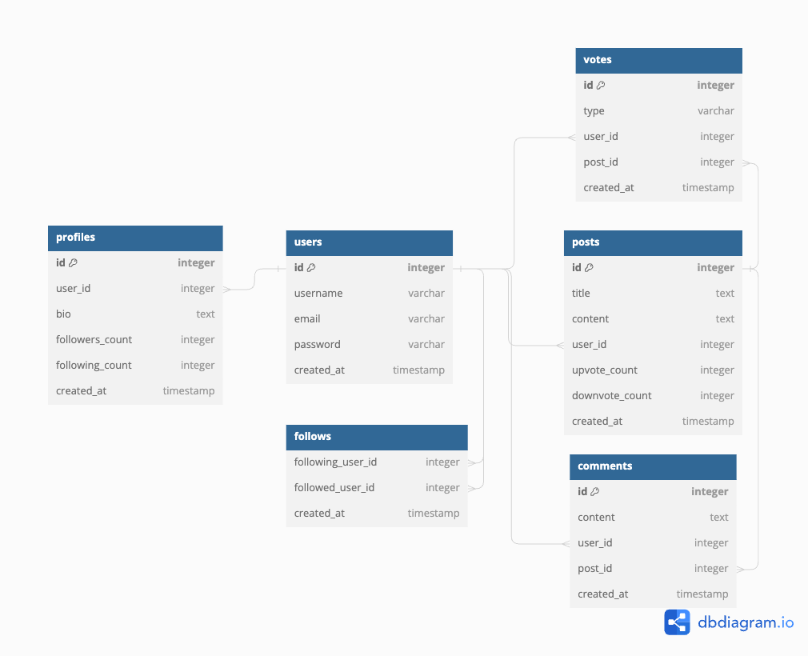

# Entity Relationship Diagram

Reference the Creating an Entity Relationship Diagram final project guide in the course portal for more information about how to complete this deliverable.

## Create the List of Tables

**Table `users`:**

| Column Name | Type      | Description                    |
| ----------- | --------- | ------------------------------ |
| id          | integer   | primary key                    |
| username    | varchar   | username of the user           |
| email       | varchar   | email address of the user      |
| password    | varchar   | securely encrypted password    |
| created_at  | timestamp | timestamp of user registration |

**Table `posts`:**

| Column Name    | Type      | Description                      |
| -------------- | --------- | -------------------------------- |
| id             | integer   | Primary key                      |
| title          | text      | Title of the post                |
| content        | text      | Content of the post              |
| user_id        | integer   | Foreign key referencing users.id |
| upvote_count   | integer   | Count of upvotes received        |
| downvote_count | integer   | Count of downvotes received      |
| created_at     | timestamp | Timestamp of post creation       |

**Table `comments`:**

| Column Name | Type      | Description                      |
| ----------- | --------- | -------------------------------- |
| id          | integer   | primary key                      |
| content     | text      | content of the comment           |
| user_id     | integer   | foreign key referencing users.id |
| post_id     | integer   | foreign key referencing posts.id |
| created_at  | timestamp | timestamp of comment creation    |

**Table `votes`:**

| Column Name | Type      | Description                      |
| ----------- | --------- | -------------------------------- |
| id          | integer   | primary key                      |
| type        | varchar   | type of vote (Upvote/Downvote)   |
| user_id     | integer   | foreign key referencing users.id |
| post_id     | integer   | foreign key referencing posts.id |
| created_at  | timestamp | timestamp of vote                |

**Table `profiles`:**

| Column Name     | Type      | Description                      |
| --------------- | --------- | -------------------------------- |
| id              | integer   | primary key                      |
| user_id         | integer   | foreign key referencing users.id |
| bio             | text      | biography of the user            |
| followers_count | integer   | count of followers               |
| following_count | integer   | count of users being followed    |
| created_at      | timestamp | timestamp of profile creation    |

**Table `follows`:**

| Column Name       | Type      | Description                                              |
| ----------------- | --------- | -------------------------------------------------------- |
| following_user_id | integer   | foreign key referencing users.id (user who is following) |
| followed_user_id  | integer   | foreign key referencing users.id (user being followed)   |
| created_at        | timestamp | timestamp of follow action                               |

## Add the Entity Relationship Diagram

